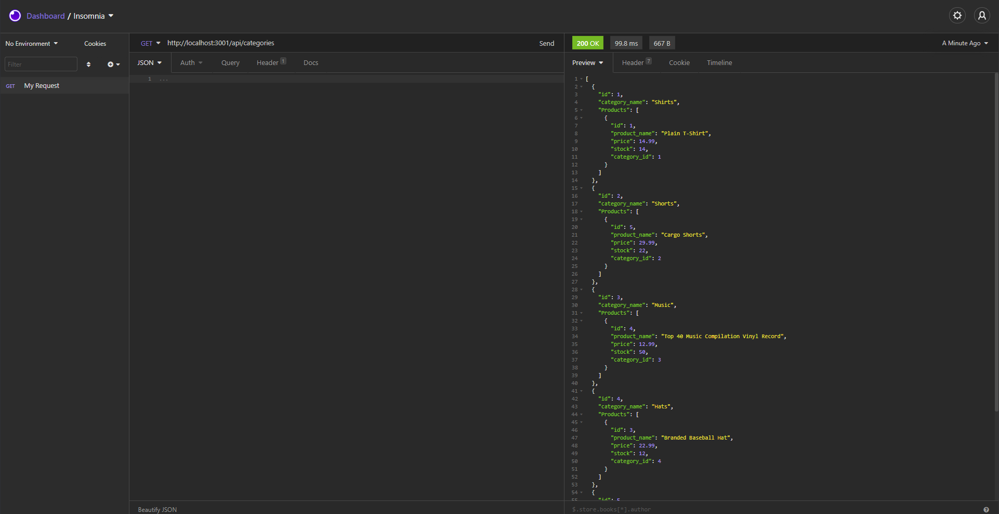

# E-Commerce-Back-End

## Application Picture



## Technologies Used 
    - Javascript - Used to write the functions of the application. 
    - Express - Used Router to create paths between files.
    - Git - Version control system to track changes to source code.
    - GitHub - Hosts repository that can be deployed to GitHub pages.

## Summary 
    Developed the back end for an e-commerce site. This is an Express.js 
    API that uses Sequelize to interact with a MySQL database.


## Code Snippet
    Down below is a code snipped from my api routes where we are using a get request to show all products along with their assoiciated Tag and Category Data
``` 
router.get('/', async(req, res) => {
  try {
    const productData = await Product.findAll({
      inclue: [{ model: Tag}, { model: Category}],
    });
    res.status(200).json(productData);
  } catch (err) {
    res.status(500).json(err);
  }
});
```

## Author Links
[LinkedIn](https://www.linkedin.com/in/liamsctewart/)<br>
[Github](https://github.com/LiamStewart8)<br>
[Application Video](https://www.dropbox.com/s/t36udgm7u7gci6t/E-Commerce-Back-End.mp4?dl=0)